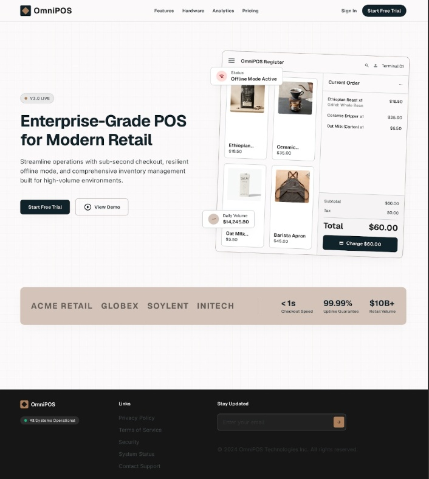

# Omni-Saas-landing-page
Modern, responsive B2B SaaS landing page for OmniPOS — an ultra-fast retail POS platform. Built with Tailwind CSS, Geist typography, and custom POS tablet terminal mockups.
# OmniPOS — Enterprise Retail SaaS Landing Page

A responsive, high-converting B2B SaaS landing page designed for **OmniPOS**, an ultra-fast, offline-first Point of Sale and inventory platform built for high-volume retail boutiques and multi-branch stores.

---

## 📸 Preview



> **Live Demo:** [https://<YOUR_GITHUB_USERNAME>.github.io/<YOUR_REPO_NAME>/]
> **Live Demo:** [https://saad-collabk.github.io/Omni-Saas-landing-page/](https://saad-collabk.github.io/Omni-Saas-landing-page/)
---

## ✨ Key Features

- **Interactive Hero POS Mockup:** A photorealistic iPad-style countertop terminal with a live product catalog, cart itemization, and checkout flow.
- **Bento Grid Architecture:** 4 core feature cards highlighting:
  - Real-time multi-location SKU inventory tracking.
  - Sub-second checkout latency (< 0.8s).
  - 100% offline SQLite resilience and cloud auto-sync.
  - Staff roles, PIN security, and shift audit logs.
- **Hardware Compatibility Suite:** Plug-and-play peripheral showcase for tablet swivel docks, 2D wireless barcode scanners, and thermal receipt printers.
- **Transparent 3-Tier Pricing:** Responsive pricing grid with interactive Monthly/Annual billing toggle and featured tier highlights.
- **Lumina Earth Design System:** High-contrast artisanal color palette (`#10232A`, `#B58863`, `#D3C3B9`, `#3D4D55`) tailored for boutique and lifestyle retail environments.

---

## 🛠️ Tech Stack

- **Markup & Layout:** Semantic HTML5
- **Styling:** [Tailwind CSS](https://tailwindcss.com/) (JIT CDN configuration)
- **Typography:** [Geist](https://fonts.google.com/) (Headings), [Inter](https://fonts.google.com/) (Body), [JetBrains Mono](https://fonts.google.com/) (Data/Pricing)
- **Icons:** [Google Material Symbols Outlined](https://fonts.google.com/icons)

---

## 📁 Repository Structure

```text
├── index.html        # Complete landing page markup & Tailwind config
├── screen.png        # UI preview screenshot
├── README.md         # Documentation and project overview
└── .gitignore        # Standard git ignore file
